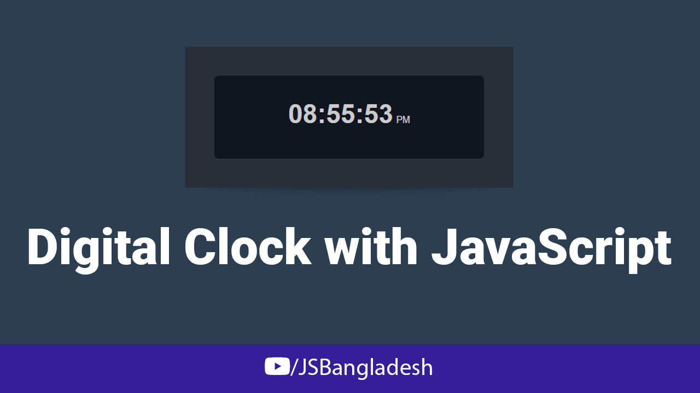

# Digital Clock with JavaScript

[Digital Clock][1] is a part of the Series [_Vanilla JavaScript Project in Bangla_][2] by [JS Bangladesh][3]

[1]: https://youtu.be/_2duo1cNTpM 'Digital Clock with JavaScript'
[2]: https://www.youtube.com/watch?v=4Rzm3BE6DL0&list=PL4iFnndHldujaLgJcoO8d4yUlAKBM55GC&ab_channel=JSBangladesh 'Full Playlist'
[3]: https://jsbangladesh.com 'Official Website'

## Project Screenshot

